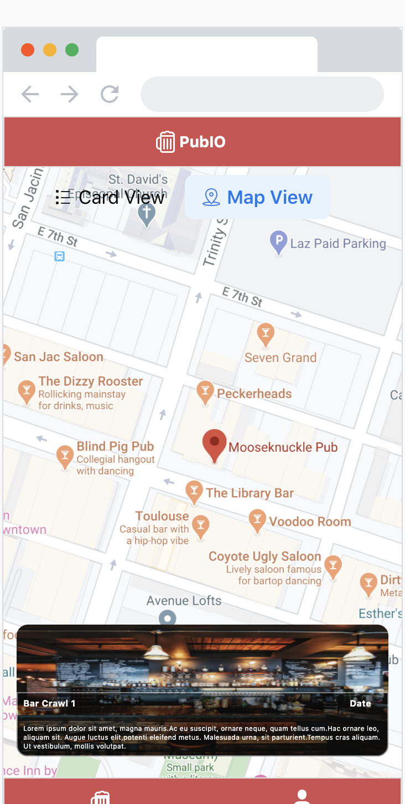

# pubIO

## Value Add Proposal

An app that:

- Allows customers to select exclusive bar crawl deals from prebuilt bundles and recieve a barcode used to redeem drink specials.
- Allows organization admins to add bar specials while preplanning their crowd and growing their customer base and traffic.

## Team Members:

- <a href="https://github.com/andrewvenson">Andrew Venson</a>
- <a href="https://github.com/kwilks3">Kim Wilks</a>
- <a href="https://github.com/mmomin11">Mubin Momin</a>
- <a href="https://github.com/tan-x">Tanner Griffin</a>

## MVP:

- User interface for customers to select a bundle deals and recieve a barcode for deal redemption
- UI for customers to view the route of the bar crawl, their barcode, current drink specials, and locations with various location data
- UI for organization admins/bar managers to scan customers barcodes and get a confirmation that the barcode is valid

## Tech Stack:
- React Native
- Firebase
- react-native-paper for CSS framework

## API List:

- Google Places
- Google Directions
- Firebase

## Flow Chart

## Project Board:

- <a href="https://github.com/pubIO-2020/pubIO/projects/1">MVP Project Board</a>

## Wireframe Examples:

